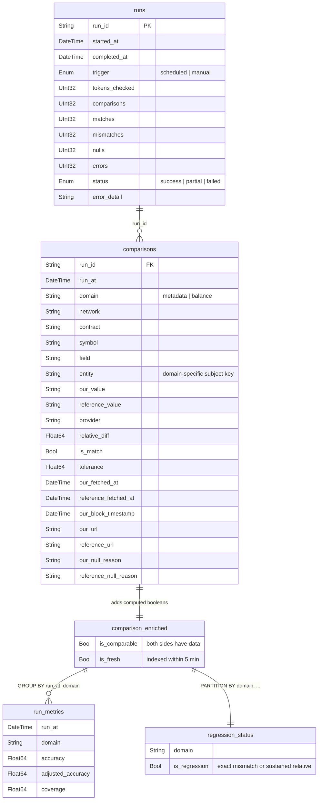

# Token API Validator

Validation service that tracks the accuracy of [Token API](https://token-api.thegraph.com) data by comparing responses against reference providers (Etherscan, Blockscout).

Runs on a schedule, stores results in ClickHouse, and exposes Prometheus metrics for Grafana dashboards.

> [!NOTE]
> See [docs/methodology.md](docs/methodology.md) for detailed documentation on what is compared, tolerance thresholds, accuracy/coverage metrics, and known limitations.

## Quick Start

```bash
# Install dependencies
bun install

# Copy and configure environment
cp .env.example .env

# Generate reference token list (requires COINGECKO_API_KEY)
bun run fetch-tokens

# Create ClickHouse tables and views
bun run init-db

# Start the service
bun run dev
```

## Endpoints

| Route | Method | Description |
|-------|--------|-------------|
| `/health` | GET | Liveness check |
| `/trigger` | POST | Trigger manual validation run |
| `/status` | GET | Current run status and progress |
| `/report` | GET | Latest run report (metrics, regressions, mismatches) |
| `/metrics` | GET | Prometheus metrics |

## Report

`GET /report` returns a JSON object with the latest validation run and per-domain results:

- **`run`** — Run summary: ID, timestamps, trigger type (`scheduled`/`manual`), status, and aggregate totals across all domains.
- **`metadata`** / **`balance`** — Per-domain results, each containing:
  - **`metrics`** — Accuracy, adjusted accuracy (fresh data only), coverage, and underlying counts. See [methodology](docs/methodology.md) for definitions.
  - **`regressions`** — Active regressions: comparisons in a sustained mismatch state.
  - **`mismatches`** — Current-run mismatches (non-regression): comparable fields that didn't match.

Returns `404` if no completed runs exist.

<details>
<summary>Example response</summary>

```json
{
  "run": {
    "run_id": "a1b2c3d4-e5f6-7890-abcd-ef1234567890",
    "started_at": "2026-03-11 12:00:00",
    "completed_at": "2026-03-11 12:05:32",
    "trigger": "scheduled",
    "tokens_checked": 743,
    "comparisons": 148260,
    "matches": 140012,
    "mismatches": 5123,
    "nulls": 3125,
    "errors": 0,
    "status": "success",
    "error_detail": null
  },
  "metadata": {
    "metrics": {
      "run_at": "2026-03-11 12:00:00",
      "matches": 3412,
      "mismatches": 123,
      "nulls": 125,
      "comparable": 3535,
      "accuracy": 0.9652,
      "adjusted_accuracy": 0.9891,
      "coverage": 0.9658,
      "total_comparisons": 3660
    },
    "regressions": [
      {
        "network": "mainnet",
        "contract": "0xdac17f958d2ee523a2206206994597c13d831ec7",
        "symbol": "USDT",
        "field": "total_supply",
        "entity": "",
        "provider": "blockscout",
        "our_value": "96119620139.51",
        "reference_value": "96118349783.47",
        "relative_diff": 0.0000132,
        "tolerance": 0.01,
        "our_url": "https://token-api.thegraph.com/...",
        "reference_url": "https://eth.blockscout.com/api/..."
      }
    ],
    "mismatches": []
  },
  "balance": {
    "metrics": {
      "run_at": "2026-03-11 12:00:00",
      "matches": 136600,
      "mismatches": 5000,
      "nulls": 3000,
      "comparable": 141600,
      "accuracy": 0.9647,
      "adjusted_accuracy": 0.9812,
      "coverage": 0.9793,
      "total_comparisons": 144600
    },
    "regressions": [],
    "mismatches": []
  }
}
```

</details>

## Environment Variables

| Variable | Required | Default | Description |
|----------|----------|---------|-------------|
| `CLICKHOUSE_URL` | **Yes** | — | ClickHouse HTTP endpoint |
| `CLICKHOUSE_USERNAME` | **Yes** | — | ClickHouse user |
| `CLICKHOUSE_PASSWORD` | **Yes** | — | ClickHouse password |
| `CLICKHOUSE_DATABASE` | No | `validation` | ClickHouse database name |
| `TOKEN_API_BASE_URL` | **Yes** | — | Token API base URL |
| `TOKEN_API_JWT` | **Yes** | — | Bearer JWT for Token API authentication ([quick start](https://thegraph.com/docs/en/token-api/quick-start/)) |
| `ETHERSCAN_API_KEY` | No | — | Etherscan V2 paid API key (single key, works across all chains) |
| `COINGECKO_API_KEY` | No | — | CoinGecko API key (only used by `fetch-tokens` script, not at runtime) |
| `CRON_SCHEDULE` | No | `0 */6 * * *` | Validation run cron schedule |
| `RATE_LIMIT_MS` | No | `500` | Delay between provider requests within a network (ms) |
| `RETRY_MAX_ATTEMPTS` | No | `3` | Max retry attempts for failed requests |
| `RETRY_BASE_DELAY_MS` | No | `1000` | Base delay for exponential backoff (ms) |
| `PORT` | No | `3000` | HTTP server port |
| `VERBOSE` | No | `false` | Enable verbose logging |
| `PRETTY_LOGGING` | No | `false` | Pretty-print log output |

## Prometheus Metrics

| Metric | Type | Labels | Description |
|--------|------|--------|-------------|
| `validator_runs_total` | Counter | `trigger`, `status` | Validation runs completed |
| `validator_run_duration_seconds` | Histogram | — | Run wall-clock duration |
| `validator_tokens_checked_total` | Counter | `network` | Tokens checked across runs |
| `validator_provider_requests_total` | Counter | `provider`, `network`, `endpoint`, `status` | Provider API requests |
| `validator_provider_request_duration_seconds` | Histogram | `provider`, `endpoint` | Provider request duration |
| `validator_provider_batch_requests_total` | Counter | `provider`, `network`, `status` | Batch API requests |
| `validator_provider_batch_fallbacks_total` | Counter | `provider`, `network` | Batch requests that fell back to individual fetches |
| `validator_provider_batch_size` | Histogram | `provider`, `network` | Number of items per batch request |
| `validator_clickhouse_writes_total` | Counter | `status` | ClickHouse write operations |

Default process metrics (memory, CPU, event loop lag) are also exported.

## ClickHouse Schema

Schema is defined in `schema/*.sql` and applied with `bun run init-db` (idempotent — safe to run repeatedly).



Also includes `accuracy_by_field` and `accuracy_by_network` views (same pattern as `run_metrics`, grouped by domain+field / domain+network). See `schema/` for full definitions.

## Scripts

- `bun run fetch-tokens` — Refresh `tokens.json` from CoinGecko (top tokens by market cap)
- `bun run init-db` — Create ClickHouse tables and views (idempotent)

Blockscout URLs and chain IDs are resolved via [The Graph Network Registry](https://networks-registry.thegraph.com/TheGraphNetworksRegistry.json), synced at startup and before each run. Etherscan uses the [V2 unified API](https://docs.etherscan.io/etherscan-v2) (`api.etherscan.io/v2/api?chainid=...`) — a single API key works across all supported chains.
